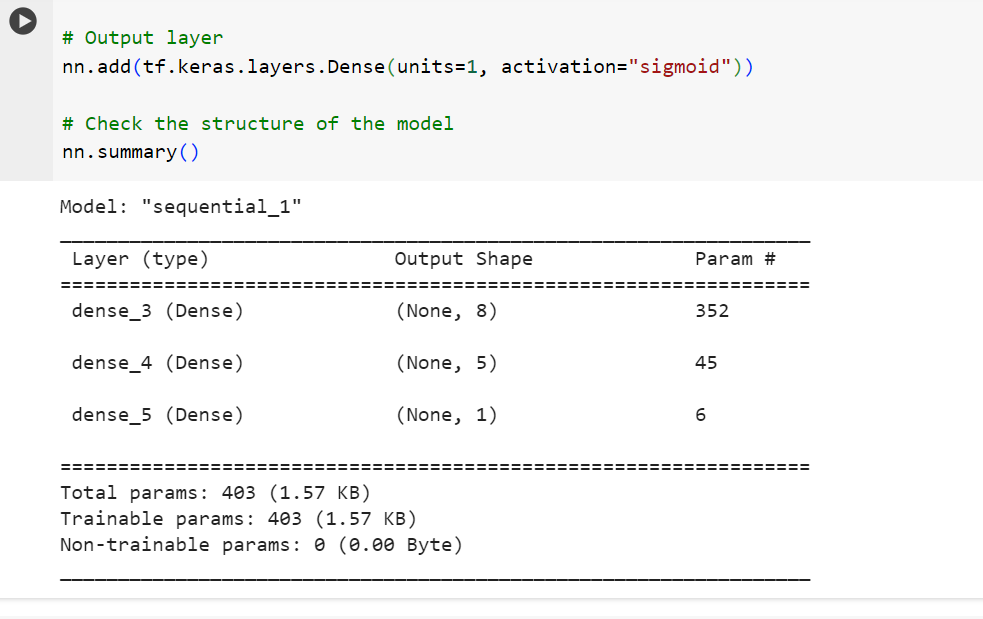
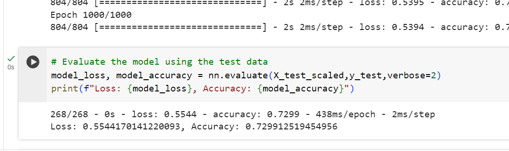
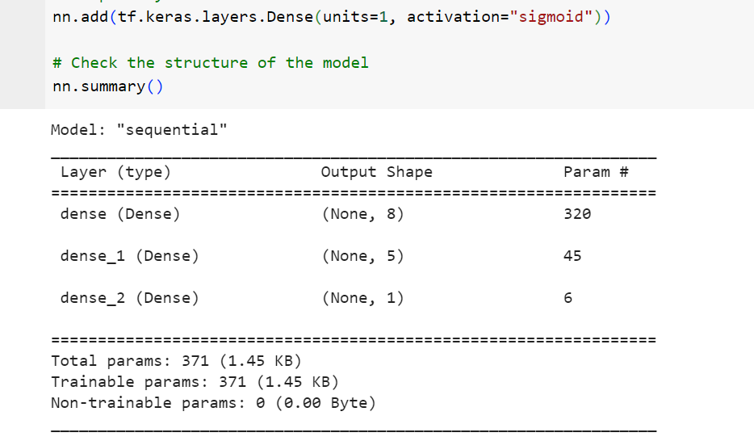
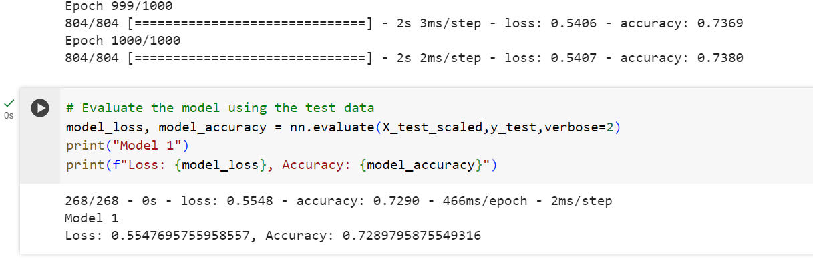
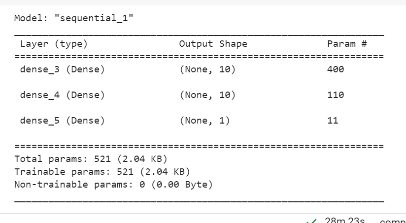
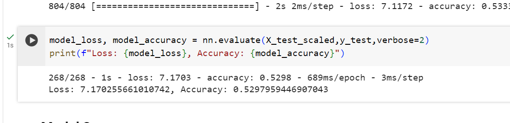
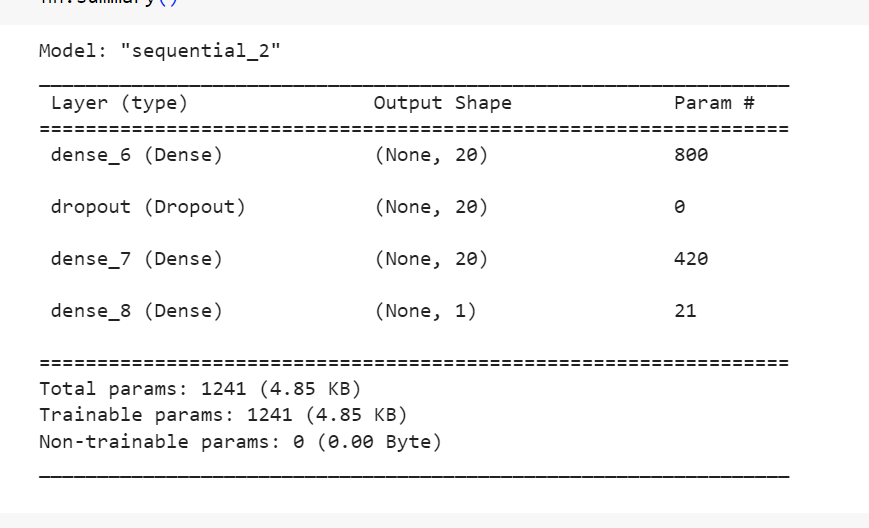
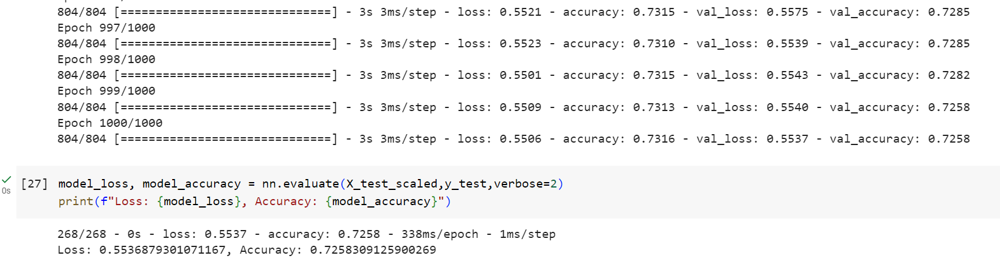
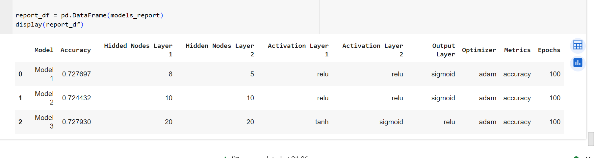

# Deep Learning Challenge

## Overview

The challenge aims to create a machine learning model for Alphabet Soup, a nonprofit foundation. Alphabet Soup wants a tool to help select funding applicants with the best chance of success in their ventures. The project involves using machine learning and neural networks to create a binary classifier that predicts whether applicants will be successful if funded by Alphabet Soup.

## Data Preprocessing

- Imported necessary dependencies: `sklearn`, `pandas`, and `tensorflow`, and loaded the dataset (`charity_data.csv`) provided by Alphabet Soup.
- Non-beneficial columns were dropped; ID columns (`EIN` and `NAME`).
- Unique values in each column were examined using `nunique()` method.
- Binned values  were explored in `APPLICATION_TYPE` and `CLASSIFICATION` columns to handle rare occurrences and improve model performance.
- Categorical data were converted to numeric using `pd.get_dummies` and then split into features (`X`, all other columns except `IS_SUCCESS`) and target (`y`, `IS_SUCCESS`) arrays.
- The data was further split into training and testing datasets and standardized using `StandardScaler`.

## Model Compilation, Training, and Evaluation

- A deep neural network model with two hidden layers two hidden layers was defined and structure printed.
  
  
- The model was compiled using binary crossentropy loss and the Adam optimizer.
- The model was trained for 1000 epochs on the preprocessed data.
  
- Evaluated the model's performance on the test dataset. This returned a model accuracy of 72.99% and a model with a low loss value of 0.5544.
 

 - This data was than exported into an HDF5 file

## Optimization Steps
Several key steps to enhance the performance of the neural network were repeated to optimise the model. These steps include data preprocessing, feature engineering, and the implementation of different neural network architectures.

### Model 1 
Model 1 optimised produced similar values to the first Neural Network Model. With a similar summary structure and summary test data  (Model loss = 0.5547 and model accuracy = 72.90%).

### Model 2 

### Model 3

## Report

